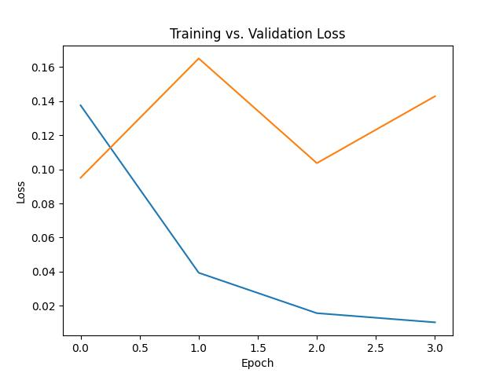
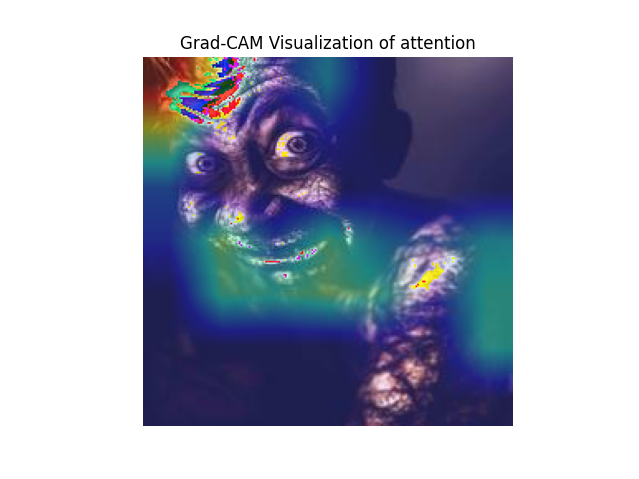
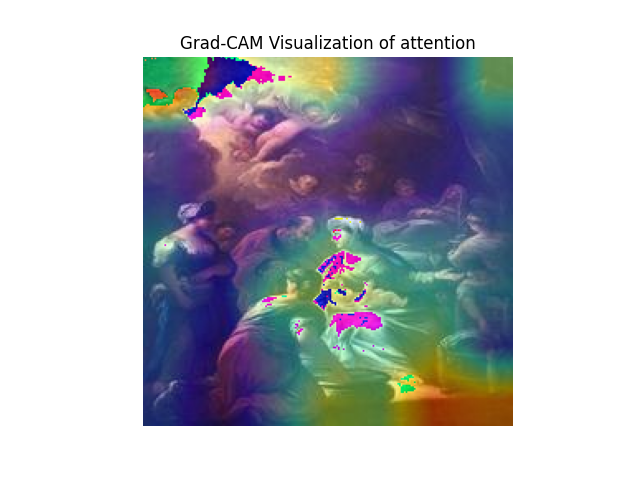

# Real vs. AI-Generated Image Classification

This project develops and evaluates a suite of deep learning models to classify images as either authentic photographs or synthetically generated by AI. The rise of powerful image generators like Stable Diffusion, Midjourney, and DALL-E poses significant challenges related to misinformation, making the ability to distinguish real from fake a critical area of research. This repository contains the code and findings from a systematic comparison of five different model architectures on this binary classification task.

**➡️ For a detailed, 27-page academic report on this project—including the full Exploratory Data Analysis (EDA), methodology, and feature importance analysis—please see the [ml_exam_report.pdf](./ml_exam_report.pdf) in this repository.**

---

## 📊 Key Results

All models performed well, but modern architectures demonstrated superior performance. The **ConvNeXtV2-Base model was the top performer**, achieving the highest accuracy on the unseen test set.

| Model | Test Accuracy | Precision (Fake/Real) | Recall (Fake/Real) | F1-Score (Fake/Real) |
| :--- | :---: | :---: | :---: | :---: |
| ResNet18 | 94.25% | 0.94 / 0.94 | 0.94 / 0.94 | 0.94 / 0.94 |
| ResNet50 | 95.56% | 0.96 / 0.95 | 0.95 / 0.96 | 0.96 / 0.96 |
| ViT Base Patch16 | 96.66% | 0.98 / 0.96 | 0.96 / 0.98 | 0.97 / 0.97 |
| ConvNeXtV2-Tiny | 96.71% | 0.98 / 0.96 | 0.96 / 0.98 | 0.97 / 0.97 |
| **ConvNeXtV2-Base** | **96.97%** | **0.96 / 0.98** | **0.98 / 0.96** | **0.97 / 0.97** |

<br>

### Top Model Performance (ConvNeXtV2-Base)
The ConvNeXtV2-Base model not only achieved the highest accuracy but also had the lowest number of critical errors (misclassifying fake images as real), making it the most robust model for this task.



Here are the confusion matrix results from the test set, which contained 5,997 real and 6,000 fake images:

| | **Predicted: Real** | **Predicted: Fake** |
| :--- | :---: | :---: |
| **Actual: Real** | **TN:** 5,754 | **FP:** 243 |
| **Actual: Fake** | **FN:** 121 | **TP:** 5,879 |

---

## ✨ Feature Importance with Grad-CAM

To understand *what* the models were "looking at" to make their predictions, Gradient-weighted Class Activation Mapping (Grad-CAM) was used. The heatmaps show that the models often focus on facial features in AI-generated images, likely detecting unnatural textures and artifacts, while focusing on broader compositional elements in real images.

Below are the Grad-CAM visualizations for the top-performing **ConvNeXtV2-Base** model on a sample fake and real image.




---

## 🛠️ Tech Stack

This project was built using Python 3.12 and leverages several key libraries from the deep learning ecosystem:

* **Core Framework:** `PyTorch`
* **Model Architectures:** `torchvision`, `timm` (for ViT and ConvNeXt models)
* **Data Handling & Analysis:** `Pandas`, `NumPy`, `scikit-learn`
* **Image Processing:** `Pillow`, `OpenCV`
* **Visualization:** `matplotlib`

---

<details>
<summary>🔧 Click here for detailed Setup and Usage Instructions</summary>

## Setup

It is recommended to use Python 3.12.x for this project, as specified in the provided `environment.yml` and `requirements.txt`.

### Option 1: Using Conda (Recommended for full environment replication)

1.  Create and activate the Conda environment using the `environment.yml` file:
    ```bash
    conda env create -f environment.yml
    conda activate exam_ml
    ```

### Option 2: Using pip and venv

1.  Create a Python virtual environment (e.g., with Python 3.12):
    ```bash
    python3.12 -m venv .venv
    ```
2.  Activate the environment:
    * On macOS/Linux: `source .venv/bin/activate`
    * On Windows: `.venv\Scripts\activate`
3.  Install the required packages using the `requirements.txt` file:
    ```bash
    pip install -r requirements.txt
    ```
4.  **Note:** Ensure you have compatible NVIDIA drivers and CUDA toolkit installed if you intend to use GPU acceleration. The scripts are configured to use CUDA if available.

## Project Structure and Files

The main scripts and important files involved in this project are:
*(Note: There are 5 versions of these files, one for each model architecture, mainly differing in model import and potentially some hyperparameters.)*

* `menu.py`: The main script to run, providing a menu to access different functionalities like preprocessing, training, and testing.
* `model_training_testing.py`: Contains the core functions for training the models, evaluating them on test/train datasets, and generating loss plots.
* `preprocessing.py`: Includes functions for image preprocessing steps, such as resizing.
* `bad_img_detector.py`: Contains functions to detect and list corrupted or unreadable images in the dataset.
* `classifier_model.pth`: This is the generic name for the saved model weights after training. Each of the 5 models will produce its own `.pth` file when trained (they are all be saved as `classifier_model.pth` within their respective model-specific run). For evaluation using the menu, ensure the relevant `.pth` file is available.
* `list_of_bad_images.txt`: Generated by `bad_img_detector.py`, listing paths to corrupted images.
* `loss_plot.jpg`: Generated by `model_training_testing.py` after training, showing the training and validation loss curves.
* `environment.yml`: Conda environment specification file.
* `requirements.txt`: Pip requirements specification file.
* **Dataset:** The project requires a dataset of real and AI-generated images. We have provided a folder with the already preprocessed images which are organized into `resized_train/real`, `resized_train/fake`, `resized_test/real`, and `resized_test/fake` subdirectories. The paths to this dataset need to be configured within `menu.py`.

## Running the Project

All operations can be managed through the `menu.py` script. Before running, ensure all Python scripts (`menu.py`, `model_training_testing.py` for the desired model, `preprocessing.py`, `bad_img_detector.py`, `classifier_model.pth`) are in the same current directory.

1.  **Customize File Paths:**
    * **Crucial Step:** Open `menu.py` and potentially `model_training_testing.py` (depending on which model you intend to work with).
    * Modify any hardcoded file paths for the dataset (input folders for original images, output folders for resized images) to match the locations on your local machine. The `menu.py` script contains path variables like `input_folder`, `output_folder`, `train` and `test_data` which **must be changed**.

2.  **Execute the Menu:**
    Run the `menu.py` script from your activated environment:
    ```bash
    python menu.py
    ```

3.  **Menu Options:**
    The menu will provide options to:
    * **1. Look for bad images:** This will run `bad_img_detector.py` on the specified dataset folders and create/update `list_of_bad_images.txt`.
    * **2. Resize images from the dataset:** This will run `preprocessing.py` to resize images from the specified input folders and save them to output folders.
    * **3. Train/Test the model:**
        * **Train the model:** This will execute the training process defined in the associated `model_training_testing.py` script.
        * **Use the model on the train dataset:** Evaluates the saved model on the training data.
        * **Use the model on the test dataset:** Evaluates the saved model on the test data.
    * **0. Exit:** Exits the menu.

### Important Considerations for Running:

* **Model Selection:** Due to there being 5 different models, the `model_training_testing.py` script and `menu.py` need to be specific to the model you want to work with. The models have been divided into folders. Ensure the version of `model_training_testing.py` you are running corresponds to the model you intend to train/test.
* **Dataset Path:** Accurate dataset paths are critical for all operations. Double-check these in `menu.py`.

</details>

---

👥 Contributors
This project was developed as a collaborative effort by:

Fredrik
Pedro